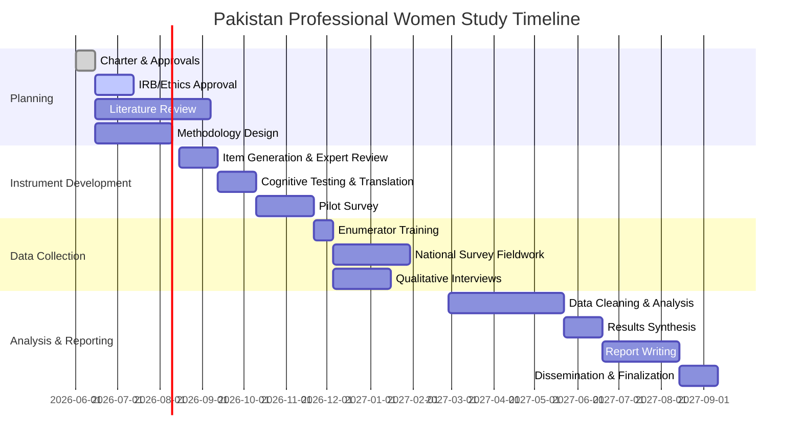

This document continues **PPWS-001-Research-Charter.md (Version 3.0)** and completes the operational, governance, and technical framework.

## Executive Summary (Supplement)

Building on the foundational vision established above, this section outlines the governance, operational procedures, and technical details needed to execute the Pakistan Professional Women Study (PPWS) successfully. It includes a formal project management structure (steering committee, roles, timeline), a complete deliverables list, risk management, data governance and ethical compliance, sampling and fieldwork plans, instrument development strategy, a synthetic population model, analysis approach, reporting/dissemination, budget guidelines, and a detailed timeline. Together, these components form a comprehensive research charter, ensuring rigor and accountability at each step. The project is budgeted in Pakistani Rupees (PKR), with a default national survey target of **N=2,000** completed responses to allow for stratification and subgroup analysis.

## Project Governance

A Steering Committee (SC) will provide oversight, comprising senior academics, NGO leaders, and government advisors (e.g. representatives from the Pakistan Bureau of Statistics or the Ministry of Planning). The Committee approves major decisions and ensures alignment with national priorities. A *Principal Investigator (PI)* leads the project and manages day-to-day operations. Supporting roles include Co-Investigators (by region or specialty), a Field Coordinator, Data/Stat Analyst, and Administrative Staff. Enumerators and Supervisors report to the Field Coordinator. Roles are defined as follows:

- **Steering Committee:** Approves overall strategy; meets quarterly; resolves high-level issues.  
- **Principal Investigator:** Project lead; responsible for overall execution, IRB approval, and reporting to funders.  
- **Co-Investigators:** Lead domain tasks (e.g. survey design, qualitative interviews) and oversee sub-teams by province or discipline.  
- **Field Coordinator:** Manages field operations, enumerator training, and data quality control.  
- **Data/Stat Analyst:** Oversees data management, cleaning, analysis, and the statistical analysis plan.  
- **Administrative Staff:** Handles logistics, travel booking, budgeting, and documentation.  
- **Enumerators & Supervisors:** Carry out survey administration (in person or online), following training and SOPs.

The governance structure is summarized below:

```mermaid
flowchart TD
    SC[Steering Committee] --> PI[Principal Investigator]
    PI --> CoI1[Co-Investigator (Survey)]
    PI --> CoI2[Co-Investigator (Qualitative)]
    PI --> CoI3[Co-Investigator (Analysis)]
    PI --> Field[Field Coordinator]
    Field --> Sup[Supervisors]
    Sup --> Enum[Enumerators]
    PI --> Analyst[Data Analyst]
    PI --> Admin[Admin Staff]
```

**Timeline & Milestones:** A high-level timeline (see section “Timeline (Gantt chart)” below) assigns key milestones, including instrument development, pilot study, survey fieldwork, interviews, analysis, and reporting phases. Interim milestones (e.g. IRB approval, pilot completion) are set. Monthly progress reports will be submitted to the Steering Committee. Major milestones include: Steering Committee formation, survey and interview instrument finalization, pilot completion, full survey data collection completion, preliminary analysis, and final report submission.

## Deliverables

| Deliverable                                          | Format           | Acceptance Criteria                                    |
|------------------------------------------------------|------------------|--------------------------------------------------------|
| **Research Charter**                                 | PDF/Markdown     | Approved by Steering Committee; covers all sections above |
| **Literature Review & Context Report**               | PDF              | Comprehensive synthesis (30+ pages); peer-reviewed references|
| **Conceptual & Causal Framework**                    | PDF & Diagram    | Visual model of domains/variables; expert-validated    |
| **Research Methodology Document**                    | PDF              | Detailed protocol (design, sampling, instruments); IRB-ready |
| **Survey Instruments (Questionnaires)**              | PDF / XLS        | Finalized questionnaires (Urdu/English); cognitive-tested |
| **Interview Guide**                                  | PDF              | Semi-structured guide (Urdu/English) for qualitative phase |
| **Scoring & Interpretation Manual**                  | PDF              | Defines scale scoring rules and interpretation bins     |
| **Pilot Study Report**                               | PDF              | Presents item analysis, reliability (α >0.70) and revisions |
| **Statistical Analysis Plan (SAP)**                  | PDF              | Pre-defined analyses (descriptive, factor, regression) |
| **Synthetic Dataset & Generator Codebook**           | CSV & PDF        | Mock data (N=2k) and variable documentation             |
| **National Survey Data (raw, anonymized)**           | CSV              | Collected dataset (N=~2000); cleaned and anonymized     |
| **Interview Transcripts (anonymized)**               | Text/CSV         | Verified transcripts of 50–100 interviews              |
| **Preliminary Findings Presentation**                | PDF/Slides       | Interim report to Steering Committee                   |
| **Final Research Report & Policy Brief**             | PDF              | Publication-ready document; policy briefs for stakeholders |
| **Journal Manuscripts (2+)**                         | PDF              | Target: 2+ peer-reviewed articles (submitted/published) |
| **Public Datasets & Code (deposited)**               | Online (GitHub or data repository) | Documentation and data shared per open-data principles (as allowed by IRB) |

Each deliverable will have specific acceptance criteria (e.g., committee approval, peer review feedback, statistical thresholds met). All documents will be in English with Urdu summaries where appropriate.

## Risk Register

A risk register will identify and mitigate threats to project success. Key risks include:

| Risk                                             | Likelihood | Impact  | Mitigation                                                              |
|--------------------------------------------------|------------|---------|-------------------------------------------------------------------------|
| **Low Survey Response Rate**                     | Medium     | High    | Increase sample frame; use reminders; offer modest incentives (e.g. phone credits); engage community networks |
| **Sampling Bias** (e.g., oversampling urban/educated) | Medium     | Medium  | Use stratified sampling by province, urban/rural, education; weight data post-survey |
| **Enumerator Error or Misconduct**                | Low        | High    | Rigorous training; supervisors perform spot-checks; double-data entry for subsample |
| **Data Privacy Breach**                          | Low        | High    | Encrypt data in transit and at rest; restrict access; anonymize PII |
| **Ethical/IRB Approval Delays**                  | Medium     | High    | Submit complete protocol early; liaise with NBC-REC/IRBs; prepare translations in advance |
| **Translation Issues** (misinterpretation)        | Medium     | Medium  | Professional translators; back-translation verification; pilot test in each language |
| **Budget Overrun**                                | Medium     | Medium  | Conservative cost estimates; contingency fund (10%); monitor expenses monthly |
| **Fieldwork Disruptions** (weather/security)      | Low        | High    | Flexible scheduling; remote data collection options; local collaborator support |
| **Data Quality Problems** (invalid responses)     | Low        | High    | Built-in validation checks; random re-contact (back-check) of sample |
| **Timeline Delays**                               | Medium     | Medium  | Detailed Gantt with buffer periods; weekly monitoring; adjust scope if needed |

*A risk register is a living document* that identifies, categorizes, and monitors potential project threats. Each risk will have an owner responsible for mitigation, and quarterly reviews will update risk status. This proactive risk management ensures issues are addressed before impacting objectives.

## Data Governance and Ethics

All data handling will follow best-practice data governance, tailored to Pakistani context:

- **Data Storage & Access:** Research data (survey and interview files) will be stored on secure, access-controlled servers (e.g. institutional cloud or encrypted drives). Only authorized team members may access identifiable data. Access will be logged and reviewed regularly.
- **Anonymization:** All Personally Identifiable Information (PII) will be removed or pseudonymized. Survey data will use anonymous respondent IDs. Interview transcripts will assign pseudonyms; any names or locations in transcripts will be redacted before analysis.
- **Data Retention:** We will retain data for at least **5 years** after project completion. (For example, Cornell’s research policy recommends ≥3 years after closure, and ≥6 if data underlies a publication.) After the retention period, data will be archived or destroyed per funder and IRB requirements.
- **Data Security:** Electronic data will be encrypted at rest and in transit. Field data collection devices (tablets/smartphones) will require passwords. Paper forms (if any) will be stored in locked cabinets and then securely destroyed after digitization.
- **Legal Compliance:** Pakistan currently has *no omnibus data protection law*; personal data is primarily protected under the **Prevention of Electronic Crimes Act (PECA) 2016 (amended 2025)**. The draft **Personal Data Protection Bill 2023** is under consideration. We will comply with PECA and anticipatory best practices (explicit consent, purpose limitation, data minimization) as there is no yet-enforced PDP law.
- **Ethical Compliance:** The PPWS will obtain informed consent from all participants. Consent forms (Urdu/English) will clearly explain study purposes, voluntary nature, risks, and confidentiality. For minors (if inadvertently reached) or vulnerable respondents, guardians’ consent will be obtained. Our protocols will be submitted to local Institutional Review Boards (IRBs) and the national **NBC-REC** for ethical approval. According to a WHO analysis, Pakistan operates a two-tier system (institutional IRBs plus NBC-REC and DRAP), with no central accreditation process. We will adhere to NBC guidelines and international ethical standards (e.g. Declaration of Helsinki).
  
  - *Example:* As Jafarey et al. note, Pakistan’s research ethics system is fragmented, lacking standardized guidelines or accreditation. We will therefore ensure rigorous self-monitoring: training all staff in ethics, requiring all field staff to sign confidentiality agreements, and including a clause in consent forms about data sharing (with anonymization). 

All procedures will align with institutional (e.g. HEC) and international research ethics norms. Participant confidentiality and welfare will be paramount. Any adverse events (e.g. interviewee distress) will trigger protocols for referral to counseling or support services.

## Sampling Strategy & Sample Size

**Sampling Frame:** The target population is approximately all Pakistani women age 25+ with a Bachelor’s or higher and professional employment. We will use multi-stage stratified sampling to ensure national representativeness:
- **Stratification:** By province/region (Punjab, Sindh, KPK, Balochistan, ICT, AJK, GB) and urban/rural residence. Within each stratum, we will use **cluster sampling** (e.g. select districts or cities, then random households or workplaces) using national frames (e.g. PBS census blocks).
- **Subgroup Quotas:** Within the sample, we will aim for adequate numbers of key subgroups (e.g. married vs. unmarried women; mothers vs. non-mothers; various career levels) to enable comparative analysis.

**Sample Size Justification:** For a national survey, we choose **N ≈ 2,000** to allow precision in estimates (margin of error ~2–3%) and enable stratified analyses. For example, Cochran’s formula for estimating a proportion (p=0.5) at 95% confidence, ±5% margin yields n≈384. To achieve tighter precision and to power subgroup analyses (married vs unmarried, by province, etc.), we increase this substantially. Accounting for design effect (clusters) and non-response (anticipated ~20–30%), the initial target is ~2,500 approached, expecting ~2,000 complete. For key comparisons (e.g., married vs unmarried groups of ~1,000 each), this yields >80% power to detect moderate effect sizes (Cohen’s d ≈ 0.2–0.3 or correlations ~0.1) at α=0.05.

**Power Calculation (Illustrative):** For an outcome like “life satisfaction” (SD≈1 on a 5-point scale), a sample of 1,000 vs 1,000 can detect a difference of ~0.14 points (d≈0.14) with 80% power. Logistic models with 10 predictors in 2,000 cases easily meet the rule-of-thumb of 10–20 cases per parameter. Thus, N=2,000 is appropriate for robust SEM and multivariate models.

**Weighting:** If sampling probabilities vary, data will be weighted to match population margins (e.g. gender, age, province distributions from PBS). This aligns with procedures used by Pew, who weighted their Pakistan survey to match province and urban/rural splits.

## Recruitment & Fieldwork SOP

**Enumerator Training:** All field staff will undergo intensive training including: survey content, ethical conduct, consent procedures, cultural sensitivity, and device use (if using tablets). Training will cover the *“why”* behind questions, improving consistency. Mock interviews and role-plays will be used. Enumerators will be trained to detect respondent distress and to maintain confidentiality. A final certification test will ensure competency.

**Consent Process:** In the field, enumerators will read an IRB-approved consent script and obtain documented consent (signed or thumbprint). For online surveys, consent will be recorded electronically. No personal identifiers beyond necessary demographics will be collected. Participants can skip any question or withdraw anytime. Confidentiality and anonymity provisions will be reiterated.

**Data Collection Modes:** Preference is face-to-face interviews (to reach rural areas and ensure response rates). In urban or pandemic circumstances, phone or secure web surveys (Urdu/English) may supplement. A mix of modes must ensure consistency in questionnaires and training. If using tablets or SurveyCTO/ODK, built-in skip logic and validation will reduce errors.

**Quality Control:** Data quality will be ensured via:
- *Field Supervision:* Supervisors will accompany 10–20% of interviews unannounced for observation.
- *Back-checks:* A random subsample (~5%) of completed surveys will be re-contacted by a supervisor to verify responses and detect fraud.
- *Daily Review:* Field coordinator will run daily data uploads to check for inconsistencies or missing data. Any issues will be flagged immediately.
- *Data Validation:* The electronic questionnaire will have logic checks (e.g. numeric ranges, required answers where appropriate). 
- *Enumerator Feedback:* Weekly check-ins allow enumerators to report challenges. Refresher training will be provided if systematic issues arise.

Enumerator conduct will be guided by a Field Manual (SOP) that includes instructions on punctuality, neutral probing, and dealing with refusal. COVID-19 precautions (masks, distancing) will be followed as needed.

## Instrument Development Plan

We will follow established scale development protocols to ensure validity and reliability:

1. **Conceptualization & Ontology:** Based on domains defined above, we derive a detailed ontology and variable dictionary (see **Appendix A**). Each latent domain (e.g. Family Pressure, Workplace Bias) and observed variable is precisely defined.

2. **Item Generation:** Survey items are drafted drawing from existing scales (where possible), literature, and expert input. Cultural context will inform new items (e.g. family terminology, local idioms). For each construct we ensure multiple items.

3. **Expert Review:** A panel of experts (academics, gender specialists, psychologists) will review items for relevance and clarity. Items will be revised accordingly.

4. **Pre-Testing (Cognitive Interviews):** Draft questionnaires (Urdu/English) will be administered to ~20 individuals in the target population to probe understanding. Cognitive interviews help refine wording and detect ambiguities (e.g. CDC guidelines on cognitive interviewing suggest this step). Revisions are made to improve comprehension and cultural appropriateness.

5. **Translation:** Instruments will be professionally translated into Urdu and key regional languages (Punjabi, Sindhi, Pashto, etc.) following forward–backward translation methods. Discrepancies will be resolved by bilingual experts, ensuring semantic and conceptual equivalence.

6. **Pilot Testing:** A pilot survey (N=100–150) will be conducted in 1–2 major cities. Psychometric analysis (reliability α and item–total correlations) and Exploratory Factor Analysis (EFA) will check that items load on intended constructs. Items with poor performance will be revised or dropped (goal α ≥ 0.70 for each scale).

7. **Finalization:** Based on pilot results, finalize survey and interview instruments. Document all changes. Prepare interviewer guidelines and training materials around the finalized instruments.

This systematic approach (ontology → drafting → review → cognitive testing → pilot → refine) follows best practices in social science research instrument development. For example, rigorous questionnaire design emphasizes testing items in context and refining through pilot data (including translation validation) before large-scale use.

## Probabilistic Population Model (Synthetic Data)

To aid preparation, we will build a probabilistic model of the Pakistani population of educated women, using available demographic data:

- **Age & Region:** Start with age distribution (e.g. 25–34: 30%, 35–44: 25%, etc.) and provincial population shares (Punjab ~38%, Sindh ~24%, etc. from PBS census).
- **Education Levels:** Adjust for the fact that only ~6% of women have a bachelor’s or higher. Use trending data to estimate growth.
- **Marital Status:** Partition by marital and parental status. For educated women 25+, perhaps ~30% never married, ~60% married, ~10% divorced/widowed (estimates informed by DHS trends).
- **Income:** Use national survey (Pakistan Bureau of Stats) for female professional incomes (e.g. mean income by education level).
- **Family Structure:** Randomly assign nuclear vs extended family contexts based on urban/rural and regional norms (e.g., Punjab more joint families).
- **Responses:** For each domain scale, assume normal or ordinal distributions with means reflecting cross-cultural studies. For example, family pressure might have mean=3.5/5 for unmarried vs 2.0 for married.

The model will use these priors to generate a synthetic dataset (N=1000, 2000, 5000) via Monte Carlo simulation. This allows testing analysis code, checking for sufficient variation, and practice scoring. Assumptions will be documented (see **Appendix B: Synthetic Data Model Summary**). If feasible, we will calibrate the model using any preliminary data (from pilot or similar studies).

## Data Analysis Plan

The Statistical Analysis Plan (SAP) will be finalized pre-data-collection. Key elements include:

- **Descriptive Statistics:** Compute means, SDs, medians, and frequencies for all variables. Tabulate respondent demographics; compare sample to census using weights if needed.
- **Scale Reliability:** Calculate Cronbach’s alpha and McDonald’s omega for each multi-item scale; target α > 0.70 for acceptable reliability. For example, items within the Family Pressure Scale will be tested for internal consistency.
- **Exploratory Factor Analysis (EFA):** Conduct EFA (e.g. principal axis factoring with oblique rotation) on each set of related items to confirm dimensionality. Retain factors with eigenvalue >1 and check item loadings ≥0.4.
- **Confirmatory Factor Analysis (CFA):** On final scales, run CFA (using lavaan or similar) to confirm measurement model; report fit indices (CFI, TLI > 0.90; RMSEA < 0.08).
- **Inferential Tests:** Compare means between married and unmarried cohorts using independent t-tests or ANOVA (and nonparametric tests as needed). Use chi-square tests for categorical differences (e.g. employment sector).
- **Regression Models:** Use multivariate regression (linear or logistic) to test hypotheses (e.g. whether family pressure predicts wellbeing). Include demographic covariates (age, education, province). Test H1–H10 from the charter using appropriate models.
- **Structural Equation Modeling (SEM):** Test the hypothesized causal model linking latent constructs (e.g. Family Pressure → Psychological Distress → Life Satisfaction). SEM will allow simultaneous estimation of multiple relationships.
- **Moderation/Mediation:** Examine if factors like economic independence moderate the impact of pressure on wellbeing. Use PROCESS or SEM to test mediation pathways (e.g. autonomy mediating the stigma–wellbeing link).
- **Subgroup Analysis:** Explore differences by region, urban/rural, or career stage using stratified analyses or interaction terms.
- **Complex Survey Adjustments:** If using stratification/clusters, incorporate survey weights, cluster standard errors, or design effect corrections as per [23].

All analyses will be conducted in R or Stata (with reproducible scripts). The SAP will specify all tests and models before data collection to prevent “p-hacking.” For reproducibility, we will adhere to reporting guidelines (e.g. APA for surveys, STROBE for cross-sectional studies).

## Reporting & Dissemination Plan

Results will be reported to diverse audiences:

- **Academic Publications:** Aim to submit at least two peer-reviewed manuscripts (e.g. one on the scale development and national findings; another on theoretical implications). Journals may include *Pakistan Journal of Social Sciences*, *Asian Journal of Women’s Studies*, or international outlets on gender or development.
- **Final Report:** A comprehensive report (40–60 pages) will document methodology, results, and recommendations. 
- **Policy Briefs:** Concise (2–4 page) briefs summarizing key findings and recommendations (in Urdu/English) will be prepared for government departments (e.g. Ministry of Planning & Development), NGOs, and corporations for workplace diversity training.
- **Presentations:** Findings will be presented at national seminars (e.g. organized with NGOs like Aurat Foundation) and international conferences.
- **Media Engagement:** Executive summaries and infographics may be shared via press releases or social media to raise public awareness.
- **Data Sharing:** An anonymized copy of the dataset (minus direct identifiers) and codebook will be deposited in an open-access repository (e.g. Zenodo or institutional archive) after publication, in line with open data practices, ensuring other researchers can use the PPWS data.

Dissemination will emphasize actionable insights: e.g., evidence-based recommendations for workplace policy (mentorship programs for unmarried women), or community outreach to mitigate stigma. If new data privacy laws come into force, findings on privacy concerns will be highlighted for reform advocacy.

## Budget Estimate (PKR)

A detailed budget will be developed, but key categories include:

| Item                    | Cost (PKR)          | Assumptions                             |
|-------------------------|---------------------|-----------------------------------------|
| Personnel (PI, Co-Is, Research Assistants) | 2,500,000 | Salaries for 2 years (PI: PKR 100k/mo, Co-I: 50k/mo, RA support) |
| Field Staff (Enumerators, Supervisors)    | 2,000,000 | 20 enumerators × 100 days × 1000/day + supervisors |
| Training & Workshops    | 300,000  | Venue, materials, trainer fees          |
| Travel & Per Diem       | 1,000,000 | Domestic travel for field teams (cars, fuel, hotels)  |
| Communication           | 100,000  | Phone/data bundles for survey            |
| Printing & Stationery   | 100,000  | Surveys, consent forms, manuals         |
| Data Processing (software/licenses) | 150,000 | SurveyCTO/Qualtrics licenses, analysis software |
| Qualitative Transcription | 200,000 | Outsourcing interview transcription    |
| Contingency (10%)       | 500,000  | Buffer for unforeseen costs             |
| **Total (approx.)**     | **6,850,000** | (~USD 25,000 at PKR 275/USD)           |

These figures are illustrative. Actual costs will be based on institutional pay scales and current travel costs. Funding requests and IRB applications will list these line items and justifications. Budget oversight will ensure expenditures align with approved categories.

## Timeline (Gantt Chart)



This Gantt chart maps the project phases from June 2026 to November 2027 (18 months). Milestones include IRB approval, pilot completion (by Nov 2026), survey completion (Jan 2027), and final reporting (Oct 2027).

## Appendices

The following will be appended to the final report as reference materials:

- **Appendix A:** PPWS Variable Dictionary (excerpt) – defines key variables and coding (e.g. Q12_FAMILY_PRESSURE: 1=Strongly Disagree to 5=Strongly Agree).  
- **Appendix B:** Sample Informed Consent Form (English/Urdu) – template used in field.  
- **Appendix C:** Sample Survey Sections – excerpts from final questionnaires (e.g. Family Pressure scale).  
- **Appendix D:** Synthetic Data Model Assumptions – summary of priors and distributions used for mock data generation.  
- **Appendix E:** Detailed Risk Register – full list of risks with scoring.  
- **Appendix F:** Example SurveyCTO Data Entry Screens – for reference.  

These appendices support transparency and allow future users to understand the methodology in detail.

